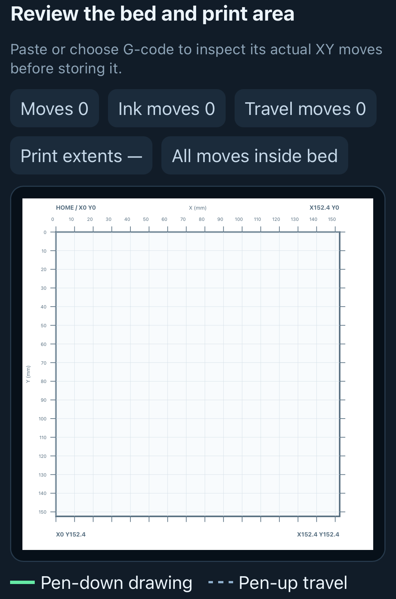
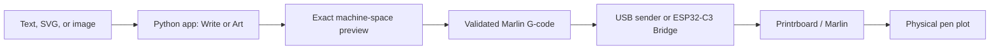

# Printrbot Pen Plotter

Local-first software and firmware for turning text, SVGs, and images into reviewed, physical pen plots on a Printrbot. It produces centerline geometry, previews the exact machine-space result, generates guarded Marlin G-code, and can send reviewed jobs by USB or through an ESP32-C3 bridge.

<p align="center">
  
</p>

> **Write → make art → review the bed preview → validate → plot.**

Licensed under the [Apache License 2.0](LICENSE).

## Why this exists

This project began by repurposing discarded Printrbot hardware instead of sending it to waste. The machine is repaired with replacement hardware and connected to a modern ESP32-C3 bridge. A proper level shifter protects the 3.3 V ESP32 UART from the Printrboard's 5 V serial signals, while the bridge provides a local Wi-Fi access point and optional same-network station mode. The image and text processing stay on the server or computer, where there is enough memory and screen space to preview the result; the ESP32 handles local communication, storage, validation, and acknowledged UART transport.

The practical reason is communication. Handwriting quality should not decide whether family members can exchange messages. The same plotter can produce readable English, Chinese, Japanese, and other languages when a matching centerline font pack is installed, so a typed message can become a physical note even when handwriting is not reliable.

The system is intended to support both sides of a paper workflow: add a new message or image to a page, and digitally remove or mask unwanted text and marks from a source before creating the replacement plot. The current Printrbot tool is a pen plotter, not a physical eraser, so removing ink from paper still requires a separate erasing tool and is not yet claimed as a machine capability.

## What it can do

| Plot real text and artwork | Reach the local controller with NFC |
| --- | --- |
|  |  |
| Centerline text, robot lettering, imported SVG, and image-derived paths. | A mounted NFC tag opens the local interface without typing an address. |

The pictured compliant pen holder is designed to tolerate pen and surface-height variation of up to roughly 3 mm. Always prove a new pen or material setup with an air plot.

### Local access without typing an address


An NFC tag can open the local bridge directly at `printrbot.local` on a phone or tablet connected to the same trusted network.

### Review before a pen touches the paper



The local Bridge shows a 10 mm bed grid, print extents, pen-down lines, and pen-up travel before the final job is stored. It supports drawing, travel, and pen-lift speed settings; validates the complete final G-code; and then exposes Start, Pause, Resume, orderly cancel, and emergency stop.

The preview and G-code are generated from the same final absolute polylines, including any explicitly enabled motion transforms. The Bridge is intentionally a **trusted local-network controller**: it does not provide authentication or OTA updates.

<br clear="right">

## Current capabilities

### Write

- Single-line centerline `hand` and `robot` stroke fonts, plus custom JSON stroke-font packs.
- Multilingual output through installed centerline font packs, including CJK fonts when available; the system plots supplied glyph trajectories and does not perform OCR or translation.
- Physical cap height, tracking, word spacing, slant, wrapping, and deterministic seeded glyph variation.
- Simple lowercase cursive joins and imported SVG paths.

### Make art

- PNG, JPEG, WebP, TIFF, and BMP input, with bounded preprocessing for large phone photos.
- Guided Studio stages for grayscale, black & white, optional edge extraction, selected art style, machine placement, and export.
- Centerline tracing for stroke-like input and contour tracing for filled shapes, logos, and silhouettes.
- Otsu/manual thresholding, inversion, blur, size limiting, and small-component cleanup.

### Place, optimize, and plot

- Explicit machine limits, paper origin, margins, scale, placement, air plot, and Z-lift control.
- Authored, nearest-endpoint, and two-opt routing; optional stroke reversal, endpoint joining, RDP simplification, resampling, and smoothing.
- Exact SVG preview with paper, ink strokes, and dashed pen-up travel; metrics for distance, travel, pen lifts, points, and idealized duration.
- Heaterless, bounds-checked Marlin G-code and a canonical `G21 → G90 → G28 → pen up` start envelope with final pen-up and `G28 X Y`.

### Run locally or through the bridge

- Direct USB preflight and acknowledged Marlin command streaming.
- ESP32-C3 bridge with local Wi-Fi/AP access, LittleFS job storage, full-file validation, browser bed preview, and one active job at a time.
- Hardware states for ready, running, paused, cancelling, cancelled, completed, failed, and emergency; separate orderly cancellation and immediate emergency stop.

## How the pieces fit



The ESP32 is intentionally the transport and safety gateway. Text generation, image processing, path optimization, and preview rendering run in the Python application; Marlin remains responsible for real-time motion and stepper control.

## Release history

The repository keeps the step-by-step implementation record, while this README describes the currently supported product:

| Release | Focus |
| --- | --- |
| [0.2](docs/RELEASE_0.2.md) | Safe-machine foundation and physical validation |
| [0.3](docs/RELEASE_0.3.md) | Native writing engine |
| [0.4](docs/RELEASE_0.4.md) | ESP32 transport |
| [0.5](docs/RELEASE_0.5.md) | Image and handwriting studio |
| [0.6](docs/RELEASE_0.6.md) | Motion quality and plot optimization |

## Safety first

- Run non-moving preflight (`M115`, `M119`, `M114`, `M503`) and an air plot before the first pen-down plot on any machine configuration.
- Every hardware-bound XY job is validated for finite coordinates, configured bounds, safe Z motion, point/command count, homing/start/end envelope, and prohibited heater, extrusion, tool-change, and `E`-axis commands.
- The Python sender validates before upload; the ESP32 validates its complete stored job again before it can run.
- Safety checks cannot detect a loose pen, reversed motor, wrong endstop direction, shifted paper, obstructions, wiring/power faults, or unwanted image-trace artifacts. Review the preview and observe the first run.

Full contract: [`docs/JOB_SAFETY.md`](docs/JOB_SAFETY.md)

## Install the Python application

Python 3.11 or newer is required.

```bash
python3 -m venv .venv
source .venv/bin/activate
python -m pip install --upgrade pip
python -m pip install -e '.[dev]'
python -m pytest
```

## Generate single-line handwriting

```bash
printrbot-plotter text "Hello from Printrbot" \
  --preset human \
  --font-size 18
```

Outputs:

```text
out/plot.svg      exact machine-space preview
out/plot.gcode    Marlin movement commands
```

Create reproducible variation:

```bash
printrbot-plotter text "banana" \
  --preset human \
  --variant-mode seeded \
  --seed 42 \
  --font-size 16
```

Cycle through authored forms:

```bash
printrbot-plotter text "aaaaaaaaa" \
  --preset human \
  --variant-mode cycle \
  --font-size 18
```

## Generate cursive-style writing

```bash
printrbot-plotter text "minimum motion" \
  --preset cursive \
  --font-size 14 \
  --wrap-width 110
```

Current cursive uses authored entry/exit anchors and simple connector curves. It does not yet implement contextual forms, ligatures, or collision-aware calligraphy. Keep global Release 0.6 routing on `authored` for normal language output.

## Generate robot lettering

```bash
printrbot-plotter text "ROBOT 06" \
  --preset robot \
  --font-size 16
```

## Inspect or load stroke fonts

```bash
printrbot-plotter fonts
printrbot-plotter fonts --font hand
printrbot-plotter fonts --file fonts/example-stroke-font.json
```

Custom font format: [`docs/STROKE_FONT_FORMAT.md`](docs/STROKE_FONT_FORMAT.md)

## Trace a raster image from the CLI

```bash
printrbot-plotter image sketch.png \
  --trace-mode contour \
  --air-plot \
  --output out/sketch.gcode \
  --preview out/sketch.svg
```

Use `--trace-mode centerline` when the raster contains stroke-like line art rather than filled regions. The default threshold is deterministic global Otsu thresholding. Override it when needed:

```bash
printrbot-plotter image sketch.jpg \
  --threshold 145 \
  --min-component 12 \
  --simplify-px 1.2 \
  --air-plot
```

For light artwork on a dark background, add `--invert`.

## Trace photographed or scanned handwriting

```bash
printrbot-plotter handwriting note.jpg \
  --air-plot \
  --output out/note.gcode \
  --preview out/note.svg
```

The handwriting command uses centerline tracing so a thick marker stroke is reduced toward one drawable path instead of producing both sides of an outline. It traces the marks as geometry; it does not recognize or retype the writing.

Export the raw pre-placement trace for manual cleanup:

```bash
printrbot-plotter handwriting note.jpg \
  --trace-svg out/note-trace.svg \
  --air-plot
```

Edit `out/note-trace.svg` in a vector editor, then re-import it:

```bash
printrbot-plotter svg out/note-trace.svg \
  --air-plot \
  --output out/note-corrected.gcode \
  --preview out/note-corrected.svg
```

## Optimize independent artwork motion

For SVG, traced images, or other independent strokes, two-opt routing can reduce pen-up travel:

```bash
printrbot-plotter svg artwork.svg \
  --motion-route two_opt \
  --air-plot \
  --output out/artwork.gcode \
  --preview out/artwork.svg
```

Clean and optimize a dense traced image:

```bash
printrbot-plotter image sketch.png \
  --trace-mode centerline \
  --motion-route two_opt \
  --rdp-tolerance 0.08 \
  --resample-spacing 1.0 \
  --air-plot
```

Conservative smoothing is explicit:

```bash
printrbot-plotter handwriting note.jpg \
  --smooth-passes 1 \
  --rdp-tolerance 0.05 \
  --air-plot
```

Joining nearby endpoints adds ink across the gap, so it is disabled by default and should only be enabled after reviewing the preview:

```bash
printrbot-plotter svg cleaned.svg \
  --motion-route two_opt \
  --join-tolerance 0.25 \
  --air-plot
```

Corner speed can be tuned separately from the normal drawing feed:

```bash
printrbot-plotter svg artwork.svg \
  --draw-feed 1200 \
  --corner-feed 600 \
  --corner-angle 70 \
  --air-plot
```

The command's metadata reports `motion_before`, `motion_after`, `travel_saved_mm`, and `travel_saved_percent` so routing changes can be evaluated before hardware use.

Release 0.6 details: [`docs/RELEASE_0.6.md`](docs/RELEASE_0.6.md)

## Run the Image & Handwriting Studio

```bash
printrbot-studio
```

Open `http://127.0.0.1:8000/`. The **Write** workspace creates centerline text; the **Art** workspace at `http://127.0.0.1:8000/studio2` processes images into plot-ready paths. Both use the same final placement and G-code safety contract.

The Studio exposes **Home all axes before plot** and enables it by default. Turning it off is useful only for offline inspection or special non-hardware workflows; the hardware validators will refuse normal XY plotting without the guarded envelope.

Studio 2 is the supported image workflow.

## Generate an air-plot calibration

```bash
printrbot-plotter calibrate --home
```

This creates:

```text
out/calibration.svg
out/calibration.gcode
```

The default calibration file is an air plot. Use `--home` for any calibration that will actually be sent to hardware. Do not use `--pen-plot` until motor direction, homing, machine origin, travel, and Z-up/Z-down have been physically validated.

## Run direct USB preflight

```bash
printrbot-plotter preflight \
  --port /dev/cu.usbmodemPrintrbot123451
```

This only queries firmware identity, endstops, position, and stored settings. It does not move the machine.

## Send a reviewed job directly over USB

Generate hardware-bound XY jobs with `--home` so they contain the canonical guarded start/end sequence. For example:

```bash
printrbot-plotter text "Hello" \
  --preset human \
  --air-plot \
  --home \
  --output out/hello.gcode \
  --preview out/hello.svg
```

Then send the reviewed job:

```bash
printrbot-plotter send out/hello.gcode \
  --port /dev/cu.usbmodemPrintrbot123451 \
  --safe-z-up 5 \
  --confirm DRAW
```

The direct USB sender validates the complete job before writing the first byte to Marlin. XY jobs without same-job X/Y/Z homing, a safe first XY state, bounds-safe motion, final pen-up, and final `G28 X Y` are rejected. The sender then waits for Marlin `ok` after every command and attempts `M400 → pen up → M400` after an ordinary cancellation or communication failure.

## Run the writing browser application only

```bash
printrbot-plotter serve
```

Open `http://127.0.0.1:8000`. For writing plus raster routes in one server, use `printrbot-studio` instead.

## Build and flash the ESP32 bridge

```bash
cd firmware/esp32
python -m pip install platformio==6.1.19
pio test -e native
pio run -e esp32-c3-devkitc-02
pio run -e esp32-c3-devkitc-02 -t upload
```

During USB flashing, disconnect external 5 V from the ESP32. The Printrboard UART can remain disconnected for the first Wi-Fi test.

After flashing:

```text
Wi-Fi:    Printrbot-Bridge
Password: plotter123
Page:     http://192.168.4.1
```

Firmware guide: [`firmware/esp32/README.md`](firmware/esp32/README.md)

HTTP API: [`docs/ESP32_API.md`](docs/ESP32_API.md)

The ESP32 uses USB flashing. There is intentionally no OTA update path in this local-controller build.

## Use the Python ESP32 client

Generate a hardware-bound job with `--home`, then:

```bash
printrbot-bridge status
printrbot-bridge upload out/plot.gcode
printrbot-bridge start
printrbot-bridge pause
printrbot-bridge resume
printrbot-bridge cancel
printrbot-bridge query M119
printrbot-bridge emergency --confirm STOP
```

`printrbot-bridge upload` performs complete-job validation before network upload. The ESP32 repeats complete stored-job validation before the job can enter `ready`.

Use another bridge address with `--url`:

```bash
printrbot-bridge --url http://printrbot.local status
```

## ESP32 and Printrboard responsibilities

```text
Python application
  text / stroke fonts / SVG / raster tracing
  variation and wrapping
  image-processing controls
  machine-space layout
  motion routing / optional path cleanup
  exact post-motion preview
  G-code generation
  complete hardware-job validation
            ↓ HTTP upload
ESP32-C3 bridge
  Wi-Fi and browser UI
  stored job validation
  one-command-at-a-time forwarding
  progress, pause, cancel, emergency
            ↓ translated UART
Printrboard Rev F4
  Marlin parser
  acceleration / junction planning
  endstops
  stepper control
            ↓
physical pen drawing
```

The ESP32 does not generate handwriting, trace images, optimize geometry, or create motion geometry. The Printrboard remains the real-time motion controller.

## UART requirement

The Printrboard uses 5 V logic and the ESP32-C3 GPIO domain uses 3.3 V logic. A proper level translator is required.

```text
Printrboard EXP1 pin 7 TX1
  → translated to 3.3 V
  → ESP32 GPIO6 RX

ESP32 GPIO7 TX
  → translated to 5 V
  → Printrboard EXP1 pin 5 RX1

EXP1 pin 14 GND ↔ ESP32 GND ↔ translator GND
```

Detailed hardware record: [`docs/HARDWARE.md`](docs/HARDWARE.md)

## Safety defaults

- Rendering and preview can deliberately omit homing, but every normal hardware-bound XY job must contain the guarded same-job homing/start/end envelope. Studio enables the visible homing control by default; CLI users include `--home` for hardware-bound generation.
- Physical font size remains meaningful instead of silently filling the page.
- Raster images are bounded and downsampled before tracing to limit geometry growth.
- Manually edited raster geometry is validated before final placement.
- Authored stroke order is the default; global route optimization is explicit.
- Endpoint joining, RDP cleanup, resampling, and smoothing are disabled by default.
- Calibration bypasses Release 0.6 motion transforms.
- Every final coordinate must be finite and inside configured bounds.
- Preview and G-code use the same exact post-motion geometry.
- The first XY motion occurs only after homing and a safe pen-up move; the final state is pen-up with X/Y re-homed and Z left raised.
- X+Y coordinated diagonal movement is valid; simultaneous XY+Z movement is rejected.
- Air-plot mode cannot lower the pen.
- Heater, extrusion, tool-change, and `E`-axis commands are rejected.
- USB physical sending requires `--confirm DRAW` and complete-job validation.
- Host-side ESP32 upload validates the complete job before network transfer; firmware validates it again before `ready`.
- ESP32 embedded `M112` is rejected inside uploaded files and exposed only through a separate emergency endpoint.
- ESP32 pause and orderly cancellation occur between acknowledged commands.
- Only one ESP32 hardware job can be active.
- The current bridge must remain on a trusted network because request-level authentication is not finished.
- Safety-contract regressions are covered by dedicated CI in addition to the repository's general Python and ESP32 checks.

The software cannot detect a loose pen, reversed motor, incorrect endstop direction, wiring fault, shifted paper, obstruction, incorrect level shifter, unstable power supply, bad photograph perspective, or unwanted trace artifacts that were not removed during review. Motion runtime values are estimates rather than measured hardware timing.

## Project documentation

- [`AGENTS.md`](AGENTS.md) — non-negotiable architecture and development guardrails
- [`docs/JOB_SAFETY.md`](docs/JOB_SAFETY.md) — canonical hardware job envelope and validator contract
- [`docs/RELEASE_0.2.md`](docs/RELEASE_0.2.md) — safe-machine foundation and remaining physical validation
- [`docs/RELEASE_0.3.md`](docs/RELEASE_0.3.md) — native writing engine and current limitations
- [`docs/RELEASE_0.4.md`](docs/RELEASE_0.4.md) — ESP32 transport progress and acceptance criteria
- [`docs/RELEASE_0.5.md`](docs/RELEASE_0.5.md) — Image & Handwriting Studio
- [`docs/RELEASE_0.6.md`](docs/RELEASE_0.6.md) — Motion Quality & Plot Optimization
- [`docs/HARDWARE.md`](docs/HARDWARE.md) — hardware, firmware, wiring, power, and sources
- [`docs/ESP32_API.md`](docs/ESP32_API.md) — embedded HTTP API
