# Printrbot Pen Plotter

Local software for turning typed language into tactile, pen-written communication on repurposed Printrbot hardware. It also converts SVGs and images into reviewed plots.

> **Status:** Release 1.0.8. The core text, image, preview, G-code, and ESP32 bridge workflows are usable; physical hardware still requires operator validation.

<p align="center">
  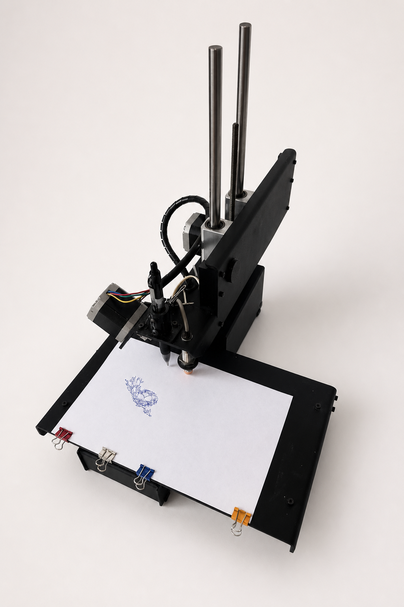
</p>

## Why it exists

This project gives discarded or incomplete plotter hardware a practical second life while helping people communicate across languages. The goal is a note that feels made by a person: a real pen moves across real paper, leaving a physical line and texture instead of only producing a digital message or a flat print.

A Printrboard remains responsible for real-time motion, while a Python application handles text and image processing, previews, layout, and G-code. An ESP32-C3 bridge provides local Wi-Fi access and acknowledged UART transport through the required 3.3 V/5 V level shifter.

The project makes written communication more accessible. A typed message can become a physical pen-written note in English, Chinese, Japanese, and other languages when the matching centerline font pack is installed. The same pipeline can prepare images and line art. It does not physically erase ink from paper; removing existing marks still requires a separate erasing tool.

## Release 1.0 milestone

This public milestone started with a **$20 used printer** and a **three-day build window** for the software UART connection, local bridge, and plotting workflow.

The goal is deliberately practical: see how far a small amount of hardware and focused software can go toward useful communication. Release 1.0 brings together:

- useful images and text on paper;
- English, Chinese, Japanese, and other installed language font packs;
- hand-written-feel centerline lettering;
- clean robotic single-line lettering;
- image-derived line art and shading; and
- a local phone workflow for preparing and printing a message.

This is a working public milestone, not a claim that the hardware is a finished commercial product. The project remains in active development, and every new machine setup still needs an air plot and physical safety check.

## Connect from a phone

The NFC tag is the front door to the local printer. Connect the phone to the same trusted Wi-Fi network, tap the tag, and the browser opens `printrbot.local` without typing an address.

<p align="center">
  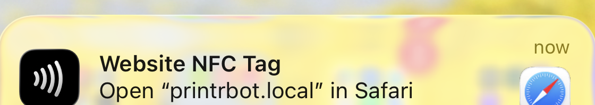
</p>

From the phone, enter a message or choose an image, review the bed preview, validate the job, and press **Start**. NFC opens the interface; it never starts motion by itself.

The phone workflow is intentionally staged:

<p align="center">
  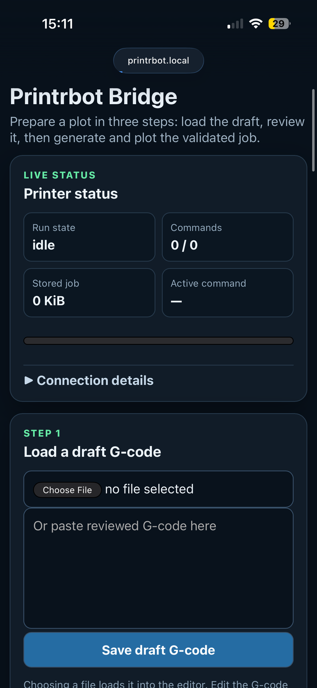
  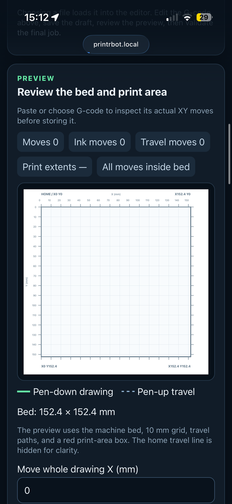
  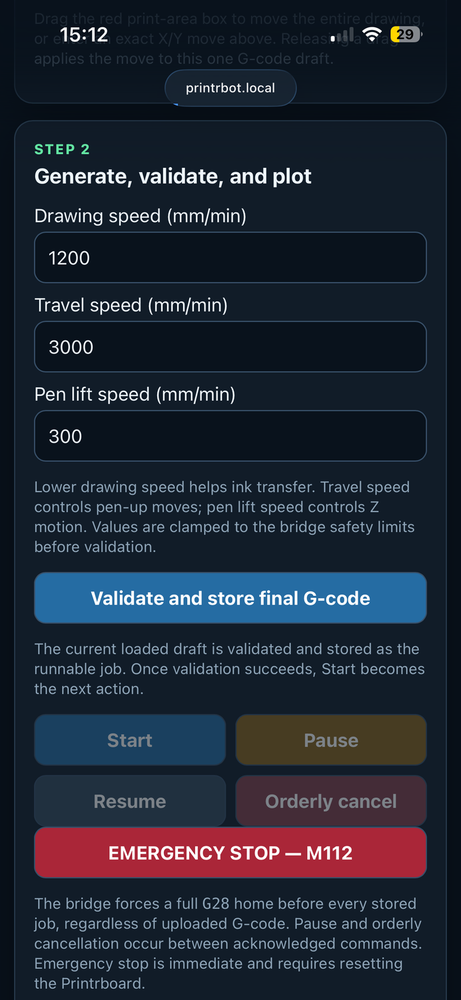
</p>

Load a draft, review its actual bed coordinates, then validate and start it. The screenshots show the same path a phone user follows; the bridge does not skip review or validation.

## Hardware in the loop

The software is built around a restored Printrbot rather than a printer-shaped abstraction. These photos show the physical parts that connect the digital workflow to the mark on paper.

<p align="center">
  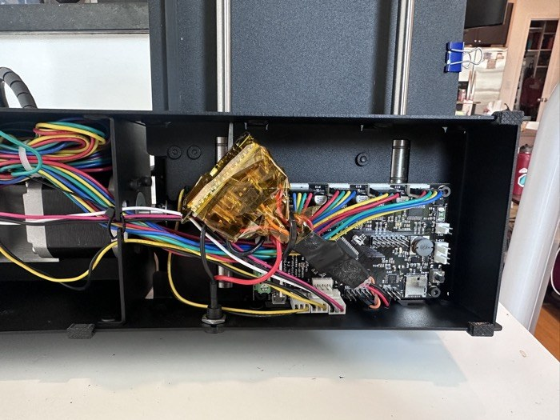
  
</p>

The control electronics and UART wiring connect the restored motion platform to the local bridge. The adjustable holder keeps the pen in contact as the writing surface varies. It accepts different tools and material heights without requiring a perfectly rigid Z surface; the operator still needs to verify the setup before plotting.

<p align="center">
  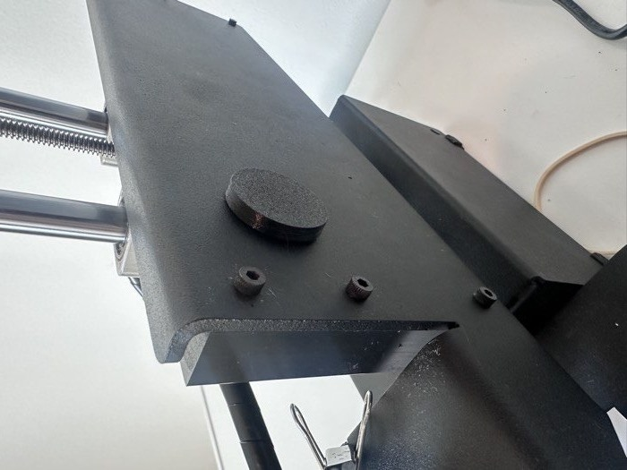
  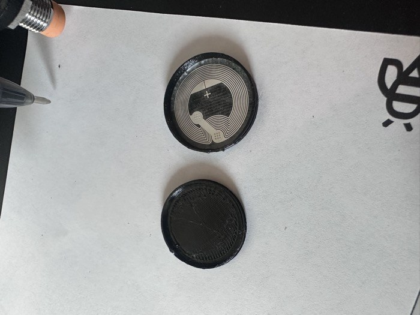
</p>

The mounted NFC tag is the physical shortcut to the local bridge. Tap it with a phone on the same trusted network, open the browser workflow, and prepare the job without typing the device address. The tag only opens the interface; it does not bypass review, validation, or the operator's Start action.

## The workflow

Each step has a separate purpose so the machine never receives an unexplained or unreviewed job.

### 1. Choose the source

Start with text, an SVG, or an image.

This keeps the input flexible while converting every source into the same internal representation: millimeter-based pen paths.

### 2. Choose how it should look

For text, choose clean Hershey Script centerlines for handwriting-style notes or robot lettering for technical marks. For images, choose grayscale, black-and-white, line-art, silhouette, or pen-shading processing.

This separates appearance from machine movement. A text font or image style describes the marks; it does not directly control the printer.

### 3. Preview and place it

Review the original, processed image, paths, paper, 10 mm grid, print-area bounds, pen-up travel, and final machine coordinates.

This is where scale, margins, origin, rotation, and placement are checked. The preview and exported G-code use the same final geometry.

### 4. Validate and export

Generate SVG for inspection and guarded Marlin G-code for the machine.

Validation checks coordinates, page limits, geometry size, safe Z motion, homing/start/end behavior, and forbidden heater, extrusion, tool-change, or E-axis commands. A job is not ready to send until it passes.

### 5. Plot locally

Send the reviewed job by direct USB or store it on the ESP32-C3 bridge for acknowledged forwarding to Marlin.

The bridge accepts one job at a time and exposes progress, pause, orderly cancel, and emergency stop. It transports the job; it does not render images or generate handwriting.

<p align="center">
  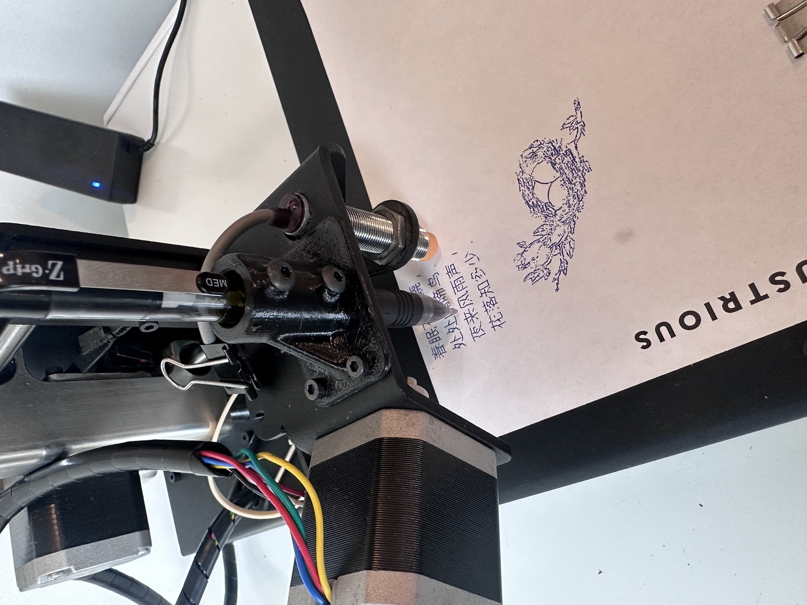
</p>

## Text to a pen-written note

<p align="center">
  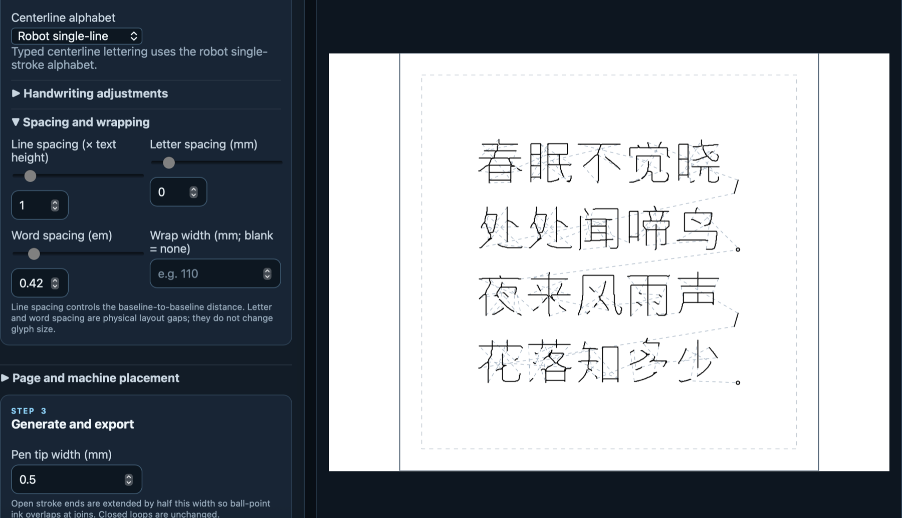
</p>

The text path does not rasterize or outline a typeface:

1. The application reads the typed characters in order.
2. A centerline font supplies one or more pen strokes for each character.
3. Font size, spacing, wrapping, slant, and language-specific font coverage are applied in millimeters.
4. The strokes become ordered XY polylines, with pen-up travel between independent marks.
5. The exact polylines are previewed and converted to validated G-code.

This is why robot lettering, hand-style lettering, and multilingual writing can share the same machine pipeline: they all end as pen paths.

## Image to a pen plot

Image processing is staged so every transformation can be inspected before it reaches the plotter.

### 1. Grayscale

<p align="center">
  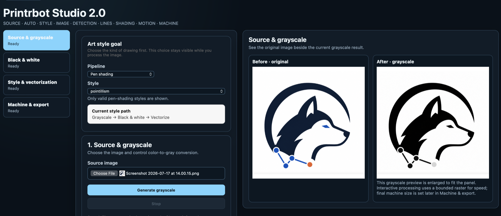
</p>

Color pixels are converted into brightness values. Exposure, contrast, gamma, channel weights, blur, and background handling can be adjusted here. The output is still a raster image; no pen paths have been created yet.

### 2. Black and white

<p align="center">
  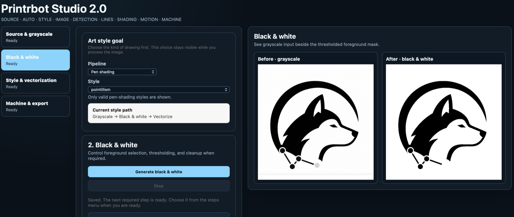
</p>

The grayscale values are compared with a manual or automatic threshold to create a foreground mask. Cleanup can remove small disconnected components and inversion can swap foreground and background. This stage decides which regions are available to the later renderer.

### 3. Style rendering

<p align="center">
  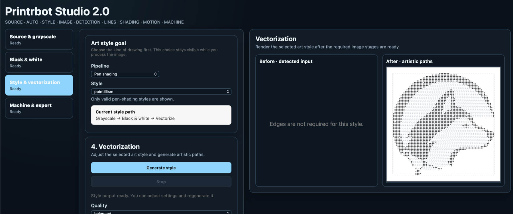
</p>

The selected style turns the processed raster into plot geometry. A silhouette or contour style follows boundaries; pen shading fills darker regions with controlled strokes or dots. Styles that work directly from the mask do not require edge extraction.

### 4. Machine output

<p align="center">
  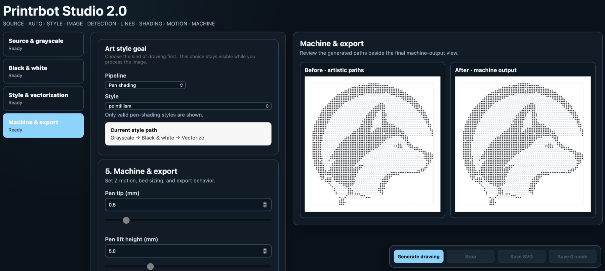
</p>

The final paths are scaled to the paper, checked against the bed, routed for pen travel, and shown in the machine preview. Only after this review are they exported as SVG and guarded Marlin G-code.

## Quick start

### Install the Python application

Python 3.11 or newer is required.

```bash
git clone https://github.com/CocoHusky/printrbot-penplotter.git
cd printrbot-penplotter
python3 -m venv .venv
source .venv/bin/activate
python -m pip install --upgrade pip
python -m pip install -e '.[dev]'
python -m pytest -q
```

### Open the browser tools

```bash
printrbot-studio
```

Open:

- `http://127.0.0.1:8000/` for writing text and preparing jobs.
- `http://127.0.0.1:8000/studio2` for the guided image workflow.

### Create centerline text

```bash
printrbot-plotter text "Hello from Printrbot" \
  --preset human \
  --font-size 18 \
  --air-plot \
  --home \
  --output out/hello.gcode \
  --preview out/hello.svg
```

`out/hello.svg` is the visual review file. `out/hello.gcode` is the machine file. Use `--preset robot` for technical single-line lettering or a matching installed font pack for additional languages.

### Trace an image

```bash
printrbot-plotter image sketch.png \
  --trace-mode contour \
  --air-plot \
  --output out/sketch.gcode \
  --preview out/sketch.svg
```

Use `--trace-mode centerline` for stroke-like drawings or photographed handwriting. The tracer follows visible marks; it does not perform OCR, translation, or handwriting recognition.

## Hardware and local access

- Printrboard / Marlin: real-time motion, acceleration, endstops, and stepper control.
- Python application: text, image processing, layout, path optimization, preview, G-code, and host validation.
- ESP32-C3 bridge: local Wi-Fi UI/API, LittleFS job storage, complete-job validation, and acknowledged UART forwarding.
- Level shifter: mandatory translation between the Printrboard's 5 V UART and the ESP32's 3.3 V GPIO.
- NFC tag: optional shortcut to the local bridge address.

The bridge is a local transport and demo controller. Its dashboard and control API use HTTP Basic authentication with a unique first-boot password. OTA firmware updates are outside the current product scope.

Hardware wiring and sources: [`docs/HARDWARE.md`](docs/HARDWARE.md)

## Safety

Always review the SVG and run an air plot before using a pen. Hardware-bound jobs require a guarded start/end envelope with homing, safe pen-up movement, configured bounds, and final pen-up state. The Python sender and ESP32 both validate the complete job.

The software cannot detect a loose pen, reversed motor, incorrect endstop direction, shifted paper, obstruction, wiring fault, unstable power, or an unwanted trace artifact. Physical validation remains the operator's responsibility.

Full contract: [`docs/JOB_SAFETY.md`](docs/JOB_SAFETY.md)

## Releases

Release **1.0.8** is the public three-day build milestone that brings the text, image, bridge, and communication workflows together, with smoother centerline lettering and clearer Graves handwriting controls. The software is usable, but physical plotting remains operator-controlled and is not a hardened commercial product.

| Release | Purpose |
| --- | --- |
| [0.2](docs/RELEASE_0.2.md) | Safe machine foundation and physical validation |
| [0.3](docs/RELEASE_0.3.md) | Native centerline writing engine |
| [0.4](docs/RELEASE_0.4.md) | ESP32 local bridge |
| [0.5](docs/RELEASE_0.5.md) | Image and handwriting studio |
| [0.6.0](docs/RELEASE_0.6.md) | Motion quality and plot optimization |
| [1.0.1](docs/RELEASE_1.0.1.md) | Public workflow plus corner-preserving centerline jitter cleanup |
| [1.0.2](docs/RELEASE_1.0.2.md) | Graves parameter wiring and handwriting/robot mode isolation |
| [1.0.3](docs/RELEASE_1.0.3.md) | Handwriting-only outline override isolation |
| [1.0.4](docs/RELEASE_1.0.4.md) | Graves default handwriting, stale-preview protection, and coordinate orientation fix |
| [1.0.5](docs/RELEASE_1.0.5.md) | Handwriting automatically selects Graves without a redundant checkbox |
| [1.0.6](docs/RELEASE_1.0.6.md) | Preserve native Graves trajectory scale |
| [1.0.7](docs/RELEASE_1.0.7.md) | Normalize pasted smart punctuation for Graves |
| [1.0.8](docs/RELEASE_1.0.8.md) | Add a stop control for in-progress renders |

## Documentation

- [`docs/HARDWARE.md`](docs/HARDWARE.md) — wiring, power, level shifting, and hardware sources.
- [`docs/JOB_SAFETY.md`](docs/JOB_SAFETY.md) — complete hardware-job safety contract.
- [`docs/ESP32_API.md`](docs/ESP32_API.md) — local bridge API.
- [`docs/ESP32_BRIDGE_HARDWARE.md`](docs/ESP32_BRIDGE_HARDWARE.md) — bridge-specific hardware details.
- [`docs/STROKE_FONT_FORMAT.md`](docs/STROKE_FONT_FORMAT.md) — custom centerline font packs.
- [`docs/NEURAL_HANDWRITING.md`](docs/NEURAL_HANDWRITING.md) — optional experimental trajectory backend.
- [`docs/RELEASE_1.0.0.md`](docs/RELEASE_1.0.0.md) — release scope, handwriting defaults, and known limits.
- Graves controls are available under the handwriting model section. Selecting handwriting uses Graves automatically; style, sampling bias, seed, and slant affect the neural trajectory, but they do not guarantee legible letterforms.
- [`docs/RELEASE_0.6.md`](docs/RELEASE_0.6.md) — motion optimization details.

## Contributing

Keep changes focused, run the relevant tests, and update the documentation when behavior changes. See [`CONTRIBUTING.md`](CONTRIBUTING.md) and [`SECURITY.md`](SECURITY.md).

## License

Apache-2.0. See [`LICENSE`](LICENSE).
